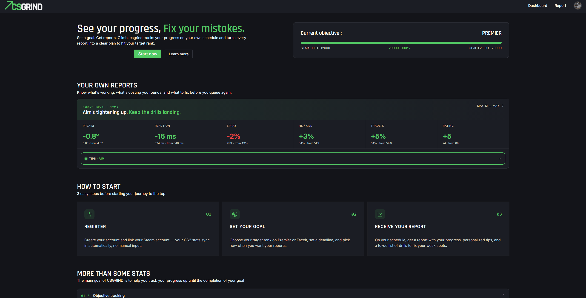

# csgrind

CSGRIND is a goal and performance tracker for the Counter-Strike 2 game.
Set an objective, get reports, see your weaknesses and strenghts, get a dynamic to-do list, tips and grind your ELO.

Free, for ever.



---

## Stack

|                    |                                                                                          |
| ------------------ | ---------------------------------------------------------------------------------------- |
| **Backend**        | TypeScript, Express 5, Prisma 6, PostgreSQL 17, Zod, node-cron                           |
| **Frontend**       | TypeScript, React 19, Vite, React Router, TanStack Query, TanStack Form, Tailwind CSS v4 |
| **Infrastructure** | Docker / Docker Compose, nginx (production frontend), GitHub Actions (CI)                |
| **External APIs**  | Leetify (CS2 statistics), Steam OpenID + Steam Web API                                   |

## Requirements

- Node.js 22
- Docker and Docker Compose

---

## Environment variables

### `.env` (repository root) — used by Docker Compose

Required to provision the PostgreSQL container.

| Variable      | Description         |
| ------------- | ------------------- |
| `DB_USER`     | PostgreSQL user     |
| `DB_PASSWORD` | PostgreSQL password |
| `DB_NAME`     | database name       |

### `backend/.env` — see [`backend/.env.example`](backend/.env.example)

The validation schema in [`backend/src/config/env.ts`](backend/src/config/env.ts) is the source of truth: the application **refuses to start** when a required variable is missing or invalid (fail-fast).

| Variable           | Required | Default                           | Description                                |
| ------------------ | -------- | --------------------------------- | ------------------------------------------ |
| `DATABASE_URL`     | ✅       | —                                 | PostgreSQL connection string               |
| `JWT_SECRET`       | ✅       | —                                 | JWT signing secret (32 characters minimum) |
| `STEAM_REALM`      | ✅       | —                                 | domain registered with Steam OpenID        |
| `STEAM_RETURN_URL` | ✅       | —                                 | return URL after Steam authentication      |
| `STEAM_API_KEY`    | ✅       | —                                 | Steam Web API key                          |
| `SITE_URL`         | —        | `http://localhost:5173`           | allowed origin (CORS) and redirect base    |
| `PORT`             | —        | `3000`                            | API listening port                         |
| `NODE_ENV`         | —        | `development`                     | `development` \| `production` \| `test`    |
| `MAIL_FROM`        | —        | `CSGrind <onboarding@resend.dev>` | email sender                               |
| `RESEND_API`       | —        | —                                 | Resend API key (email notifications)       |

### `frontend/.env` — see [`frontend/.env.example`](frontend/.env.example)

| Variable       | Description                                                                          |
| -------------- | ------------------------------------------------------------------------------------ |
| `VITE_API_URL` | API base URL. ⚠️ Injected **at build time** by Vite: changing it requires a rebuild. |

---

## Running in development

Database in a container, backend and frontend running locally with hot reload.

```bash
# 1. Database
docker compose up -d db

# 2. Backend
cd backend
cp .env.example .env        # then fill in the values
npm ci
npx prisma db push          # apply the schema
npx prisma db seed          # insert badges, tips and tasks
npm run dev                 # http://localhost:3000

# 3. Frontend (separate terminal)
cd frontend
cp .env.example .env
npm ci
npm run dev                 # http://localhost:5173
```

> **Note**: the seed inserts badges, tips and tasks, and is idempotent (safe to re-run). Additional tips and tasks can be created through the admin pages (`/admin/tips`, `/admin/tasks`).

## Running the full stack with Docker

```bash
docker compose up --build
```

| Service          | URL                   |
| ---------------- | --------------------- |
| Frontend (nginx) | http://localhost:8080 |
| API              | http://localhost:3000 |
| PostgreSQL       | `localhost:5432`      |

On the first start only, apply the schema and the seed:

```bash
docker compose exec backend npx prisma db push
docker compose exec backend npx prisma db seed
```

---

## Project structure

### Backend — layered architecture

Every request goes through the layers in this order, with one responsibility per layer:

```
routes/         endpoint definitions and applied middlewares
controllers/    input validation (Zod), HTTP status codes, response shaping
handlers/       business logic (report generation, progress, badges)
repositories/   data access — the only layer allowed to use Prisma
```

Cross-cutting modules:

| Directory      | Purpose                                                            |
| -------------- | ------------------------------------------------------------------ |
| `config/`      | environment variable validation at startup                         |
| `schemas/`     | Zod schemas, shared with the frontend through the `@backend` alias |
| `middlewares/` | authentication, centralized error handling, rate limiting          |
| `errors/`      | domain error classes (`BadRequestError`, `NotFoundError`, …)       |
| `jobs/`        | scheduled tasks (report generation, Leetify GDPR check)            |
| `selectors/`   | selection rules for tips, tasks and badges                         |
| `comparators/` | comparison between two reports (statistics deltas)                 |
| `mappers/`     | mapping Leetify responses to the internal model                    |
| `lib/`         | external clients (Leetify, Steam), JWT, helpers                    |
| `prisma/`      | data schema and seed                                               |

### Frontend

| Directory        | Purpose                                           |
| ---------------- | ------------------------------------------------- |
| `pages/`         | one page per route                                |
| `components/ui/` | reusable components                               |
| `services/`      | API calls, validated with the backend Zod schemas |
| `hooks/`         | TanStack Query hooks                              |
| `auth/`          | authentication context and protected routes       |
| `layouts/`       | global layout                                     |
| `lib/`           | HTTP client, helpers                              |

---

## Scheduled jobs

| Time (Europe/Paris) | Job                                                                            |
| ------------------- | ------------------------------------------------------------------------------ |
| 07:00               | Leetify account check — deletes reports when the source account is gone (GDPR) |
| 13:00               | Generates the reports due according to each goal's frequency, then emails a notification linking to each new report |

---

## Continuous integration

[`.github/workflows/ci.yml`](.github/workflows/ci.yml) runs on every pull request and on pushes to `master` and `staging`:

- **backend**: `npm ci` → `prisma generate` → `typecheck`
- **frontend**: `npm ci` → `lint` → `build`

The `master` branch is protected: pull requests are mandatory and status checks must pass before merging.

---

## Deployment

> TODO: see [`docs/deploiement.md`](docs/deploiement.md)

## Credits

Game statistics provided by [Leetify](https://leetify.com).

> TODO: license, author
